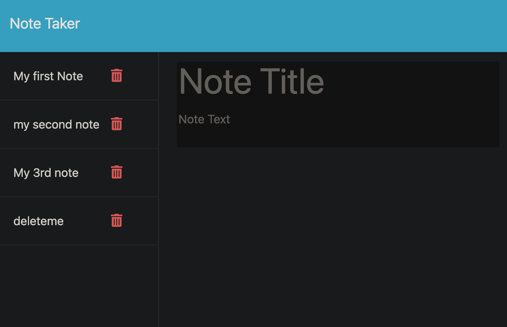

# Note Taker

Ryan Hanzel

Bootcamp @ UT Austin | Module 11 Assignment

## Description

Note Taker is a simple note taker app the showcases basic GET/POST routes with a expressJS server.

## Links

## Usage

- For Development use the command ``` npm run dev ```
- To start the server use the command ``` npm start ```
- Open [Server URL](http://localhost:3001/) in your browser and navigate through the 'Let's begin link'
- Write in a title and body for your note and click the save note button in the top right
- There is a clear all button if you want to clear your note and start over
- To delete a note click the red trash can icon next to the individual note you wish to delete

## Screenshots

